# 아이톡(AITALK) 
생성형 AI기술 기반의 언어치료교구

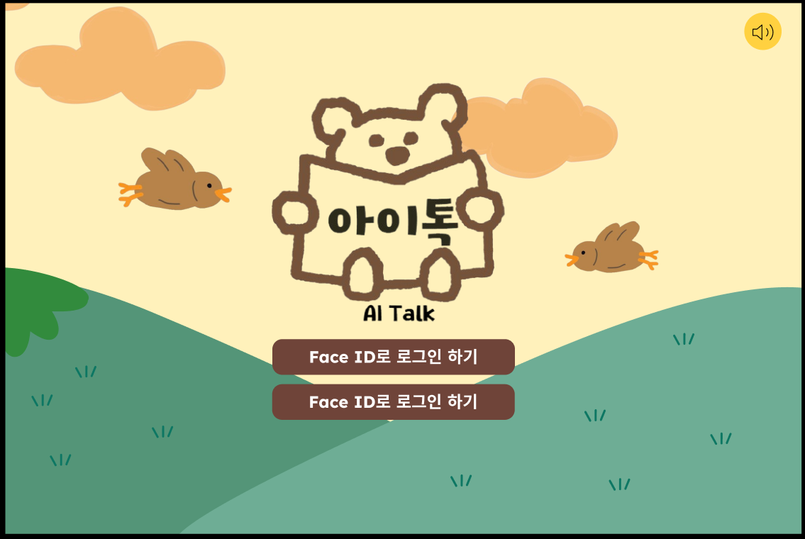

## :speaking_head: 프로젝트 소개 

> ⌛ 프로젝트 기간 : 2025년 1월 13일 ~ 2월 21일

### 개요

#### SSAFY 12기 2학기 공통 프로젝트

생성형 AI 기술과 IoT가 접목된 본 언어치료용 AI 교구 디바이스는 기존의 그림카드나 인쇄물 교구와는 차별화된 혁신적인 솔루션입니다. 이 디바이스는 아이톡의 효과음, 다채로운 애니메이션, 그리고 귀여운 외관을 통해 치료 아동의 흥미를 자연스럽게 유도하며, 치료 환경을 보다 즐겁고 몰입감 있게 만들어줍니다.

또한, AI톡톡이와의 실시간 대화 기능은 폐쇄형 질문과 아동 개인 데이터를 기반으로 맞춤형 대화를 구성하여, 아동이 자신의 언어 능력에 자신감을 가질 수 있도록 돕습니다. 실시간 대화 시스템은 아동의 반응과 학습 패턴을 분석해 개별 맞춤형 피드백을 제공함으로써, 효과적인 언어 치료를 지원합니다.

더불어, NFC 카드 태깅을 활용한 단어치료는 아동이 직접 치료 과정에 참여할 수 있도록 설계되어, 학습에 대한 흥미와 자발적인 참여를 높입니다. 사물 인식을 통해 생성된 이미지로 상황을 설명하는 치료 방법은 기존의 교구나 물건들을 재활용할 수 있을 뿐만 아니라, 다양한 상황 이미지를 제공하여 언어치료사가 자료를 준비하는 번거로움을 크게 해소해 줍니다.

이처럼, 본 디바이스는 최신 AI 기술과 IoT를 결합하여 언어치료 현장에서의 다양한 문제점을 혁신적으로 해결하고, 아동의 언어 학습 및 치료 효과를 극대화하는 데 기여할 것입니다.

## 👥 팀 구성
<table style="text-align: center;" width="100%">

   <tr>
    <th style="text-align: center;" width="16.66%"></th>
    <th style="text-align: center;" width="16.66%"></th>
    <th style="text-align: center;" width="16.66%"></th>
    <th style="text-align: center;" width="16.66%"></th>
    <th style="text-align: center;" width="16.66%"></th>
    <th style="text-align: center;" width="16.66%"></th>
  </tr>

  <tr>
    <td style="text-align: center;" width="16.66%">천세윤 </td>
    <td style="text-align: center;" width="16.66%">박수민 </td>
    <td style="text-align: center;" width="16.66%">이수환 </td>
    <td style="text-align: center;" width="16.66%">김우영 </td>
    <td style="text-align: center;" width="16.66%">최진문 </td>
    <td style="text-align: center;" width="16.66%">김경민 </td>
  </tr>
    <tr>
    <td style="text-align: center;" width="16.66%">백엔드,프론트  (팀장)</td>
    <td style="text-align: center;" width="16.66%">백엔드</td>
    <td style="text-align: center;" width="16.66%">인프라, 임베디드</td>
    <td style="text-align: center;" width="16.66%">프론트</td>
    <td style="text-align: center;" width="16.66%">프론트</td>
    <td style="text-align: center;" width="16.66%">백엔드</td>
  </tr>
  <tr>
    <td style="text-align: center;" width="16.66%">로그인, 치료 아동 관리, 카드 태깅 관련 api, DB관리 / 언어치료사 웹 화면 제작, 스케줄 관리 캘린더 제작</td>
    <td style="text-align: center;" width="16.66%">스케줄 관련 api, 대화하기 api, 센터 관련 api, 로컬 id,pw 로그인, 로컬 아동 목록, 치료 시작하기, 3어문 api</td>
    <td style="text-align: center;" width="16.66%">CI/CD 구축, 생성형AI 모델을 활용한 이미지 생성,  jetson orin nano 환경 세팅 및 개발, GPU서버 rootless 개발</td>
    <td style="text-align: center;" width="16.66%">전체 피그마 디자인 및 컴포넌트 구성, 디바이스(사물인식, NFC 태그, AITalk) API 연동, AiTalk socket연동, NFC 태그 데이터 관리</td>
    <td style="text-align: center;" width="16.66%">웹 관리자 페이지(로그인 외) 구성, Redux기반 상태 관리, 얼굴인식 로그인 및 등록 API 연동, 디바이스 로그인(NFC, ID/PW) API 연동</td>
    <td style="text-align: center;" width="16.66%">회원가입, 치료사(유저) 관리 관련 api, face ID 등록 및 로그인 api,실시간 사물인식 api,영상 포트폴리오 제작 </td>
  </tr>
</table>

## 🔗 주요 기술

### [ Front ] 

- React: 서비스 소개 웹 페이지 제작을 위한 라이브러리
- TypeScript: 코드의 안정성 및 유지 보수성을 높이는 강력한 타입 시스템 제공
- Redux: 여러 컴포넌트가 공유하는 상태를 관리하기 위한 라이브러리. Dispatch와 Selector를 통해 유연하고 효과적인 상태 관리
  - 상태를 하나의 저장소(Store)에 모아두고, 순수 함수인 리듀서(Reducer)를 통해 오직 액션(Action)을 기반으로만 상태를 갱신
- Axios: 애플리케이션에서 HTTP 비동기 통신을 쉽고 효율적으로 처리
- LottieFiles: UX 향상을 위한 애니메이션 JSON Parser
- Charkra UI: 미리 정의된 컴포넌트 블럭을 통한 디자인 통일성 보장
- coco-ssd: 객체 탐지를 위한 딥러닝 모델
  - coco 데이터셋 기반 객체 탐지
  - single shot 아키텍처 기반 경량화
  - tensorflow.js 를 통한 간편한 react 연동

### [ Back ]

- Socket을 이용한 실시간 대화하기
  - Whisper API 기반 음성 인식
음성 입력 → 텍스트 변환을 위해 Whisper API 사용
음성 인식 정확도 향상 및 긴 문장 처리 가능
  - 실시간 소통을 위한 WebSocket :
WebSocket을 활용하여 실시간 음성 데이터 전송 및 응답 처리
대기 시간 최소화 및 자연스러운 대화 흐름 구현
  - Typecast.ai 기반 음성 합성
Typecast.ai를 활용하여 텍스트를 자연스러운 음성으로 변환
챗봇이 응답할 때, 자연스러운 목소리로 안내 가능
  - ChatGPT API 기반 자연어 처리
ChatGPT API를 활용하여 아동의 대화 및 치료 과정 지원
맥락을 이해하고 자연스러운 답변을 제공하여 대화 품질 향상

- 빠른 이미지 생성을 위하여 이미지 생성 시간 약 94.86% 단축
    - 문제점 :
    - Stable Diffusion 3.5 Large 모델 사용 시, 이미지 생성 속도가 3분 34초로 너무 느렸음.
    - 고성능 GPU(Tesla V100)를 사용했음에도 성능이 기대보다 낮았음.
    - 원인 분석 : 
    - GPU 연산 방식 차이:
Tesla V100은 기본적으로 FP32(32비트 부동소수점 연산) 사용
일반적인 노트북/데스크톱 GPU는 FP16(16비트 부동소수점 연산) 사용
FP16 연산이 FP32 대비 속도가 빠르고 메모리 사용량이 적음
    - 해결 방법 :
      1. PyTorch에서 FP16(16-bit Half Precision) 연산 적용
torch_dtype=torch.float16 설정
torch.cuda.empty_cache()로 GPU 메모리 캐시 비우기 (누수 방지)
Stable Diffusion 3 Pipeline을 FP16 모드로 실행
      2. 모델 변경 및 최적화
FP16 적용 후: 3분 34초 → 24초로 단축
모델을 3 Medium으로 변경 후: 24초 → 11초로 추가 단축
    - 성능 개선 결과
3분 34초 → 24초 (약 88.79% 감소)
24초 → 11초 (약 54.17% 감소)
전체적으로 94.86% 속도 개선 🎉

### [ 협업툴 ]

<ul>
  <li>GitLab: 프로젝트의 코드와 문서 관리</li>
  <li>Jira: 프로젝트 일정, 이슈 및 작업 관리</li>
  <li>Scrum (Agile): 1주 주기의 프로젝트 스프린트와 매일 5분의 스크럼미팅을 통한 통한 긴밀한 팀 협업과 소통</li>
  <li>Mattermost: 팀 내 의사소통 및 파일 공유를 지원하는 협업 도구 활용</li>
  <li>ERD Cloud : 테이블 및 데이터 관리 도구</li>
  <li>Figma: 프로젝트의 UI/UX 설계 및 디자인 구축, 팀원 간의 효과적인 디자인 커뮤니케이션</li>
</ul>

## 📌 주요 기능

### 디바이스

<strong>로그인, 얼굴등록, 아동 선택 </strong>

<table style="text-align: center;" width="100%">
  <tr>
    <th style="text-align: center;" width="25%">페이스 아이디 로그인</th>
  </tr>
  <tr>
    <td style="text-align: center;" width="25%">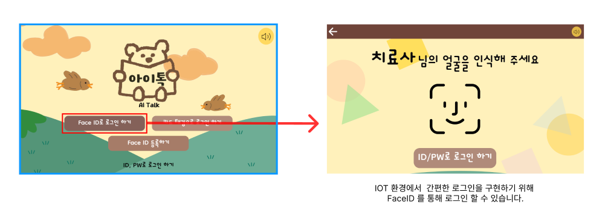</td>
  </tr>
  <tr>
    <td style="text-align: center;" width="25%">간편 얼굴 인식 로그인을 통한 빠른 로그인이 가능합니다.</td>
  </tr>
</table>

<table style="text-align: center;" width="100%">
  <tr>
    <th style="text-align: center;" width="25%">아이디 비밀번호 로그인</th>
  </tr>
  <tr>
    <td style="text-align: center;" width="25%">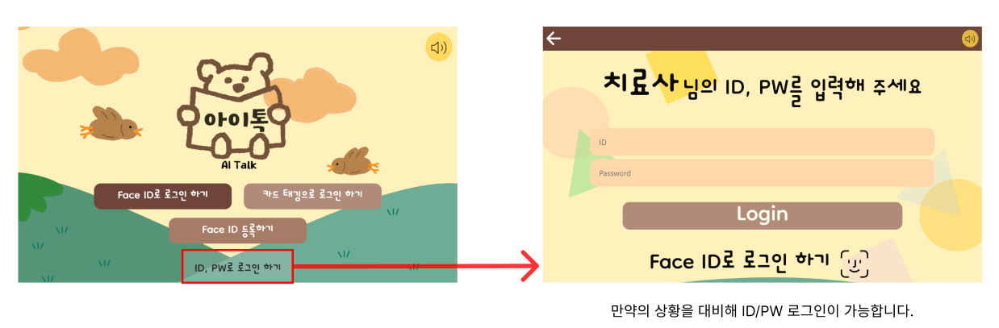</td>
  </tr>
  <tr>
    <td style="text-align: center;" width="25%">얼굴인식 실패 시 아이디와 비밀번호로 로그인이 가능합니다.</td>
  </tr>
</table>

<table style="text-align: center;" width="100%">
  <tr>
    <th style="text-align: center;" width="25%">카드 로그인</th>
  </tr>
  <tr>
    <td style="text-align: center;" width="25%">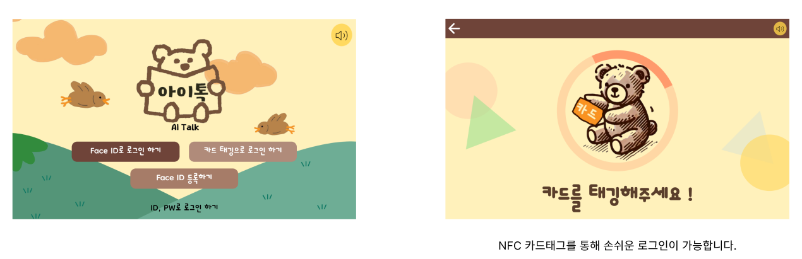</td>
  </tr>
  <tr>
    <td style="text-align: center;" width="25%">NFC 카드를 이용하여 카드태깅으로 로그인이 가능합니다.</td>
  </tr>
</table>

<table style="text-align: center;" width="100%">
  <tr>
    <th style="text-align: center;" width="25%">얼굴 등록</th>
  </tr>
  <tr>
    <td style="text-align: center;" width="25%">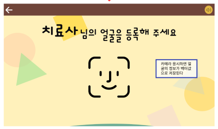</td>
  </tr>
  <tr>
    <td style="text-align: center;" width="25%">얼굴 인식을 통해 얼굴을 등록할 수 있습니다.</td>
  </tr>
</table>

<table style="text-align: center;" width="100%">
  <tr>
    <th style="text-align: center;" width="25%">아동 선택 </th>
  </tr>
  <tr>
    <td style="text-align: center;" width="25%">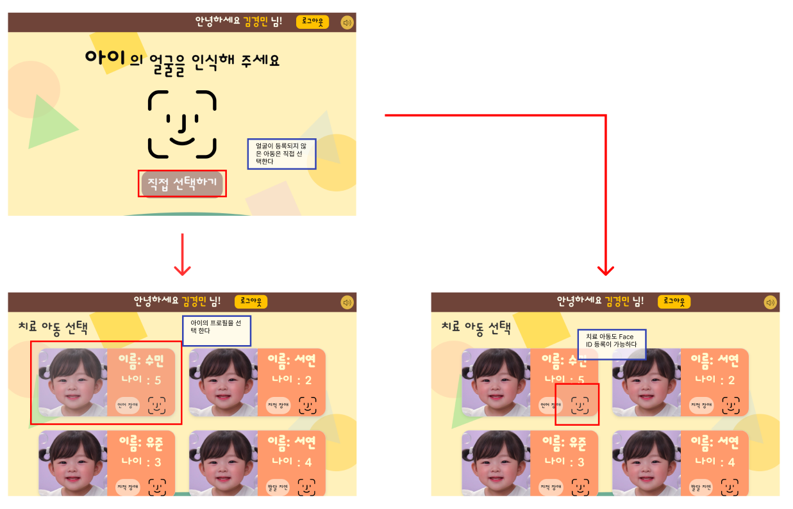</td>
  </tr>
  <tr>
    <td style="text-align: center;" width="25%">아동 얼굴 인식 혹은 리스트에서 치료 아동을 선택할 수 있습니다.</td>
  </tr>
</table>

<strong>카드 태깅</strong>

<table style="text-align: center;" width="100%">
  <tr>
    <th style="text-align: center;" width="25%">1. 카드 태깅 페이지</th>
  </tr>
  <tr>
    <td style="text-align: center;" width="25%">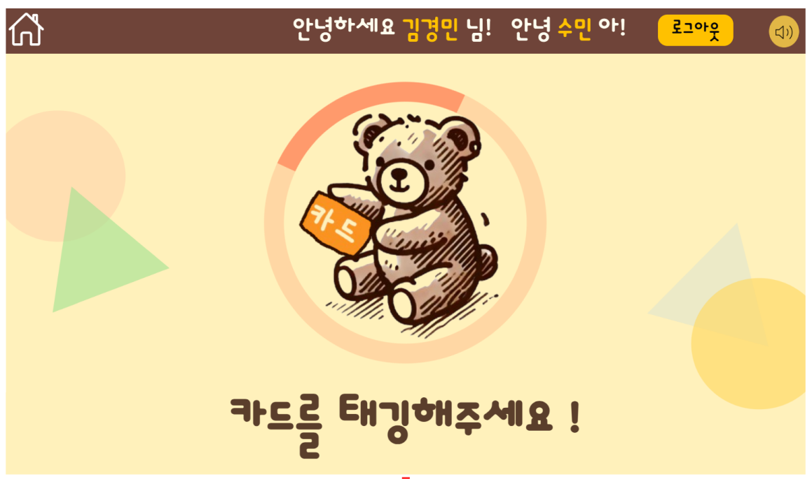</td>
  </tr>
  <tr>
    <td style="text-align: center;" width="25%">카드 태깅을 위한 로딩 페이지 입니다.</td>
  </tr>
</table>

<table style="text-align: center;" width="100%">
  <tr>
    <th style="text-align: center;" width="25%">2. 카드 태깅 후 이미지</th>
  </tr>
  <tr>
    <td style="text-align: center;" width="25%">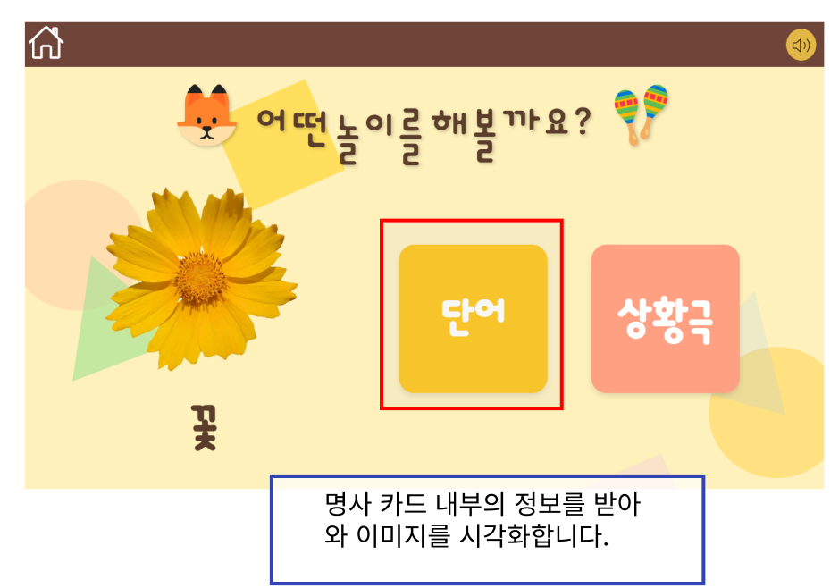</td>
  </tr>
  <tr>
    <td style="text-align: center;" width="25%">명사 카드 태깅 후 카드의 칩에 담긴 데이터를 가져와 디바이스에 이미지를 띄웁니다. 단어 버튼 선택 시 단어 치료로 이동하고, 상황극 선택 시 상황 이미지를 ai로 생성해서 띄웁니다.</td>
  </tr>
</table>

<table style="text-align: center;" width="100%">
  <tr>
    <th style="text-align: center;" width="25%">3. 동사 카드 추가 태깅</th>
  </tr>
  <tr>
    <td style="text-align: center;" width="25%">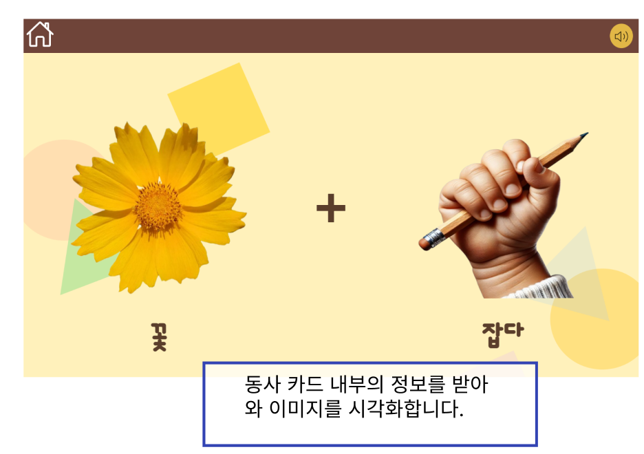</td>
  </tr>
  <tr>
    <td style="text-align: center;" width="25%">명사 카드 태깅 후 동사 카드 태깅 시 동사 이미지가 디바이스에 뜹니다.</td>
  </tr> 
</table>

<table style="text-align: center;" width="100%">
  <tr>
    <th style="text-align: center;" width="25%">3-1. 명사 + 동사 이미지 생성 </th>
  </tr>
  <tr>
    <td style="text-align: center;" width="25%">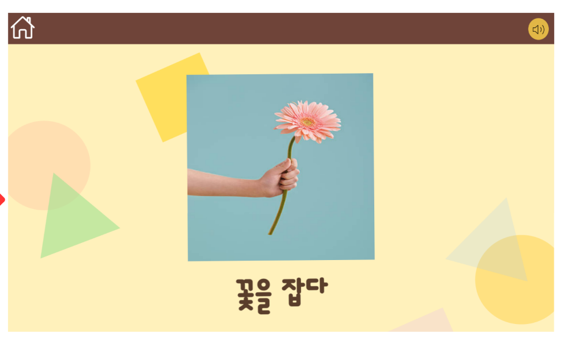</td>
  </tr>
  <tr>
    <td style="text-align: center;" width="25%">명사와 동사를 합한 2어문으로 이미지를 생성하여 화면에 띄웁니다.</td>
  </tr>
</table>

<table style="text-align: center;" width="100%">
  <tr>
    <th style="text-align: center;" width="25%">4. 상황극 버튼 선택 </th>
  </tr>
  <tr>
    <td style="text-align: center;" width="25%"></td>
  </tr>
  <tr>
    <td style="text-align: center;" width="25%">태깅된 명사 카드의 이미지에서 상황극 버튼 클릭 시 이미지를 생성합니다. 이미지 생성을 위해 AI 프롬포트 작성을 하여 생성합니다.</td>
  </tr>
</table>

<table style="text-align: center;" width="100%">
  <tr>
    <th style="text-align: center;" width="25%">4. 상황극 버튼 선택 </th>
  </tr>
  <tr>
    <td style="text-align: center;" width="25%"></td>
  </tr>
  <tr>
    <td style="text-align: center;" width="25%">태깅된 명사 카드의 이미지에서 상황극 버튼 클릭 시 이미지를 생성합니다. 이미지 생성을 위해 AI 프롬포트 작성을 하여 생성합니다.</td>
  </tr>
</table>

<table style="text-align: center;" width="100%">
  <tr>
    <th style="text-align: center;" width="25%">4-1. 상황극 이미지 생성 </th>
  </tr>
  <tr>
    <td style="text-align: center;" width="25%"></td>
  </tr>
  <tr>
    <td style="text-align: center;" width="25%">AI에 의해 생성된 이미지와 상황에 대한 텍스트를 기반으로 상황 설명 치료를 시작합니다.</td>
  </tr>
</table>

<strong>사물 인식 이미지 생성</strong>

<table style="text-align: center;" width="100%">
  <tr>
    <th style="text-align: center;" width="25%">1. 사물 인식 페이지</th>
  </tr>
  <tr>
    <td style="text-align: center;" width="25%">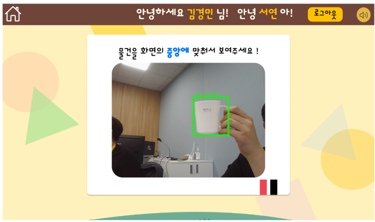</td>
  </tr>
  <tr>
    <td style="text-align: center;" width="25%">주변 사물 또는 기존의 교구를 카메라에 비춰 사물인식을 시작합니다. 현재 컵을 비춘 모습입니다.</td>
  </tr>
</table>

<table style="text-align: center;" width="100%">
  <tr>
    <th style="text-align: center;" width="25%">2. AI 이미지 생성</th>
  </tr>
  <tr>
    <td style="text-align: center;" width="25%">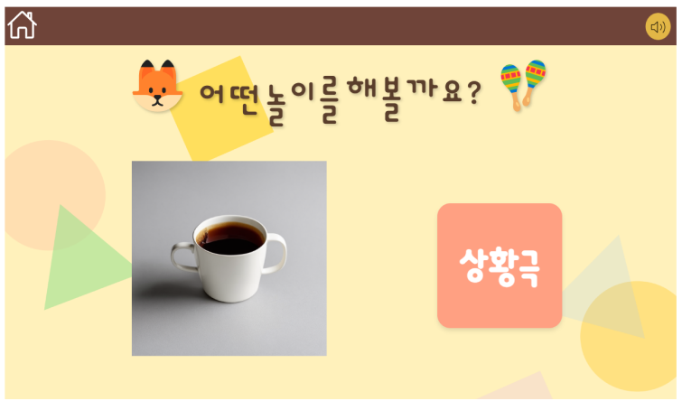</td>
  </tr>
  <tr>
    <td style="text-align: center;" width="25%">인식한 사물 텍스트를 이용하여 사물 이미지를 생성합니다. 그 후 상황극 버튼 클릭 시 해당 이미지로 상황 이미지를 생성합니다.</td>
  </tr>
</table>

<table style="text-align: center;" width="100%">
  <tr>
    <th style="text-align: center;" width="25%">3. 상황 이미지 생성</th>
  </tr>
  <tr>
    <td style="text-align: center;" width="25%">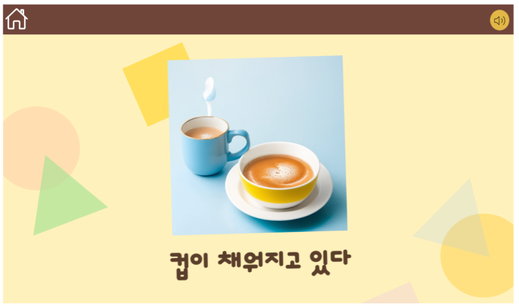</td>
  </tr>
  <tr>
    <td style="text-align: center;" width="25%">사물 텍스트를 이용하여 gpt로 상황 텍스트를 생성 후 이미지 생성 ai를 이용한 생성형 이미지를 띄워줍니다. 언어치료사와 아동이 해당 이미지로 상황 설명 치료를 할 수 있습니다.</td>
  </tr> 
</table>

<strong>톡톡이와 대화하기</strong>

<table style="text-align: center;" width="100%">
  <tr>
    <th style="text-align: center;" width="25%">1. 대화하기 선택 페이지</th>
  </tr>
  <tr>
    <td style="text-align: center;" width="25%">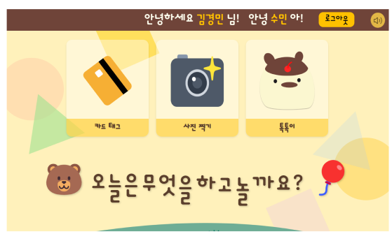</td>
  </tr>
  <tr>
    <td style="text-align: center;" width="25%">치료 선택 페이지에서 톡톡이와의 대화 버튼을 선택합니다. 아동의 데이터를 기반으로 치료아동을 위한 대화가 시작됩니다.</td>
  </tr>
</table>

<table style="text-align: center;" width="100%">
  <tr>
    <th style="text-align: center;" width="25%">2. AI와 실시간 대화하기</th>
  </tr>
  <tr>
    <td style="text-align: center;" width="25%">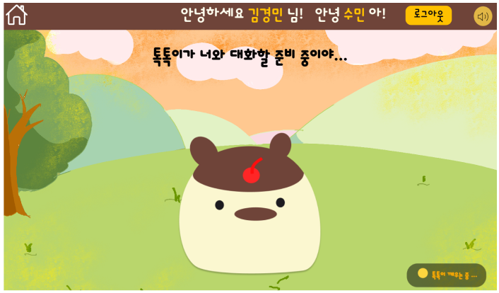</td>
  </tr>
  <tr>
    <td style="text-align: center;" width="25%">아동의 수준에 맞춘 대화를 시작합니다. 아동은 단순한 질문들을 통해 대화에 자신감을 가지게 됩니다.</td>
  </tr>
</table>

### 웹페이지

<strong>로그인, 회원가입, 아이디 찾기, 비밀번호 변경 </strong>

<table style="text-align: center;" width="100%">
  <tr>
    <th style="text-align: center;" width="25%">1. 로그인 페이지</th>
  </tr>
  <tr>
    <td style="text-align: center;" width="25%">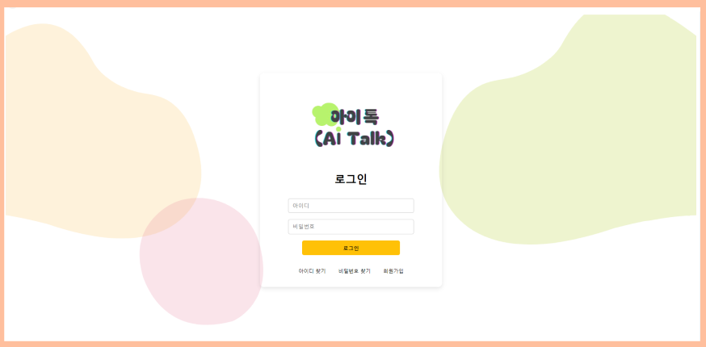</td>
  </tr>
  <tr>
    <td style="text-align: center;" width="25%">아이디와 비밀번호를 통하여 언어치료사가 로그인합니다.</td>
  </tr>
</table>

<table style="text-align: center;" width="100%">
  <tr>
    <th style="text-align: center;" width="25%">2. 회원가입 페이지</th>
  </tr>
  <tr>
    <td style="text-align: center;" width="25%">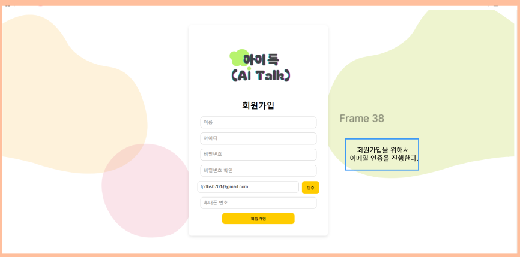</td>
  </tr>
  <tr>
    <td style="text-align: center;" width="25%">회원가입을 진행합니다. 이메일 인증을 진행합니다.</td>
  </tr>
</table>

<table style="text-align: center;" width="100%">
  <tr>
    <th style="text-align: center;" width="25%">2-1. 회원가입 이메일 인증</th>
  </tr>
  <tr>
    <td style="text-align: center;" width="25%">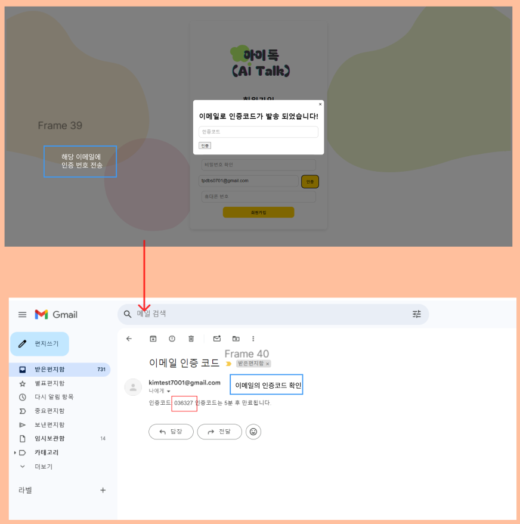</td>
  </tr>
  <tr>
    <td style="text-align: center;" width="25%">이메일 요청 시 인증 코드가 해당 이메일로 전송됩니다.</td>
  </tr>
</table>

<table style="text-align: center;" width="100%">
  <tr>
    <th style="text-align: center;" width="25%">3. 아이디 찾기 </th>
  </tr>
  <tr>
    <td style="text-align: center;" width="25%">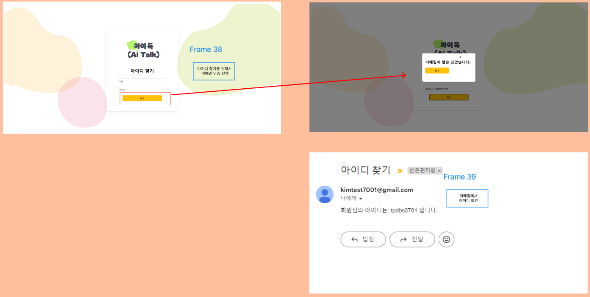</td>
  </tr>
  <tr>
    <td style="text-align: center;" width="25%">아이디 찾기를 진행합니다. 이름과 이메일로 인증 시 해당 이메일로 아이디가 전송됩니다.</td>
  </tr>
</table>

<table style="text-align: center;" width="100%">
  <tr>
    <th style="text-align: center;" width="25%">4. 비밀번호 변경 </th>
  </tr>
  <tr>
    <td style="text-align: center;" width="25%">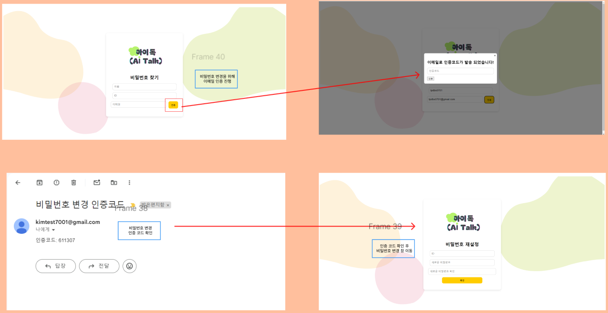</td>
  </tr>
  <tr>
    <td style="text-align: center;" width="25%">비밀번호 변경을 진행합니다. 이름과 아이디 이메일로 인증 시 해당 이메일로 인증 코드가 발송되고, 인증코드를 기입하면 비밀번호 변경창으로 이동합니다.</td>
  </tr>
</table>

<strong>스케줄 관리 페이지</strong>

<table style="text-align: center;" width="100%">
  <tr>
    <th style="text-align: center;" width="25%">1. 한달 스케줄 확인</th>
  </tr>
  <tr>
    <td style="text-align: center;" width="25%">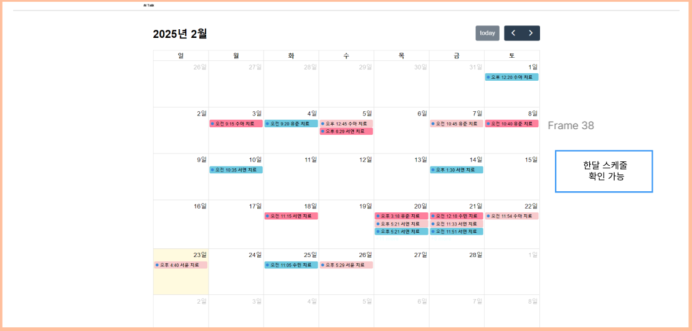</td>
  </tr>
  <tr>
    <td style="text-align: center;" width="25%">한달의 전반적인 스케줄을 확인이 가능합니다. </td>
  </tr>
</table>

<table style="text-align: center;" width="100%">
  <tr>
    <th style="text-align: center;" width="25%">2. 일정 확인</th>
  </tr>
  <tr>
    <td style="text-align: center;" width="25%">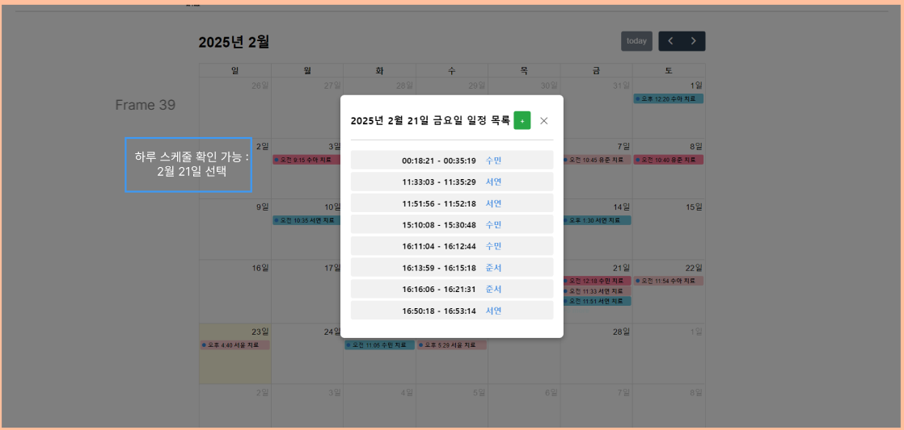</td>
  </tr>
  <tr>
    <td style="text-align: center;" width="25%">하루 일정을 확인할 수 있습니다.</td>
  </tr>
</table>

<table style="text-align: center;" width="100%">
  <tr>
    <th style="text-align: center;" width="25%">3. 스케줄 상세 내용 확인</th>
  </tr>
  <tr>
    <td style="text-align: center;" width="25%">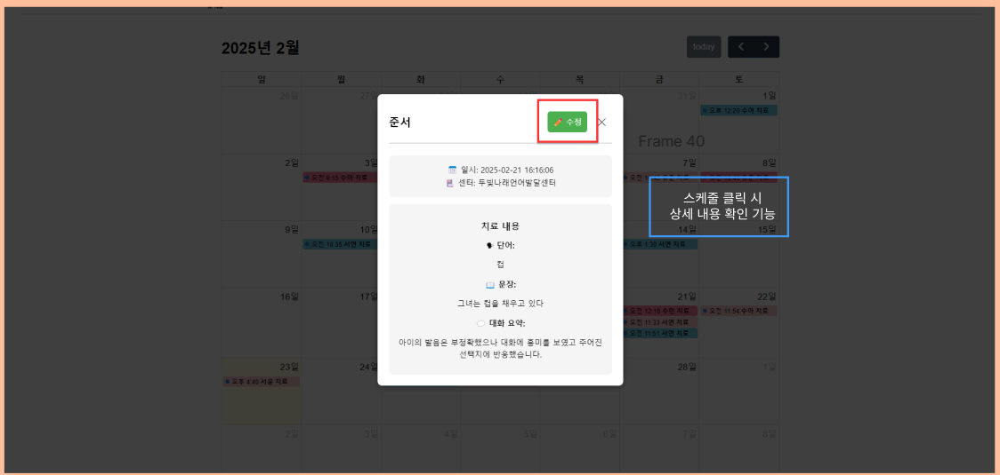</td>
  </tr>
  <tr>
    <td style="text-align: center;" width="25%">하나의 스케줄 클릭 시 치료 내용과 치료 아동의 정보를 상세히 볼 수 있습니다.</td>
  </tr>
</table>

<table style="text-align: center;" width="100%">
  <tr>
    <th style="text-align: center;" width="25%">4. 스케줄 수정 </th>
  </tr>
  <tr>
    <td style="text-align: center;" width="25%">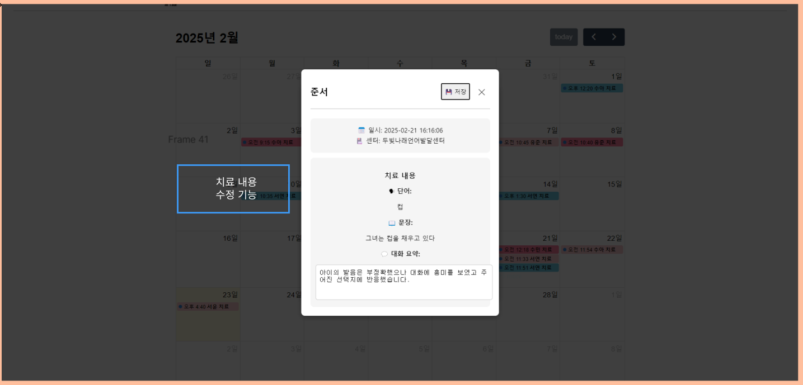</td>
  </tr>
  <tr>
    <td style="text-align: center;" width="25%">스케줄 수정 시 대화요약 내용에서 치료 시 특이 사항 등을 작성하여 수정이 가능합니다.</td>
  </tr>
</table>

<table style="text-align: center;" width="100%">
  <tr>
    <th style="text-align: center;" width="25%">5. 스케줄 등록 </th>
  </tr>
  <tr>
    <td style="text-align: center;" width="25%">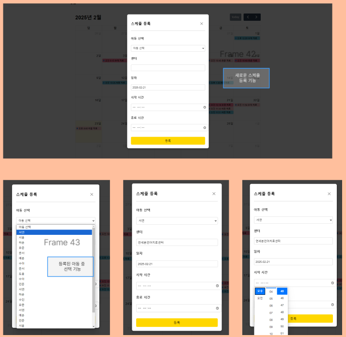</td>
  </tr>
  <tr>
    <td style="text-align: center;" width="25%">새로운 스케줄을 등록합니다. 아동을 선택하면 해당 아동이 있는 센터가 자동으로 지정됩니다. 치료 시간 등을 기입할 수 있습니다.</td>
  </tr>
</table>

<strong>치료 아동 관리 </strong>

<table style="text-align: center;" width="100%">
  <tr>
    <th style="text-align: center;" width="25%">1. 치료 아동 리스트</th>
  </tr>
  <tr>
    <td style="text-align: center;" width="25%">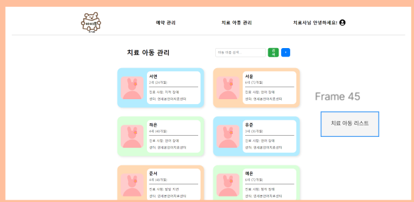</td>
  </tr>
  <tr>
    <td style="text-align: center;" width="25%">언어치료사가 담당하는 아동 전체를 볼 수 있습니다.</td>
  </tr>
</table>

<table style="text-align: center;" width="100%">
  <tr>
    <th style="text-align: center;" width="25%">2. 아동 검색</th>
  </tr>
  <tr>
    <td style="text-align: center;" width="25%">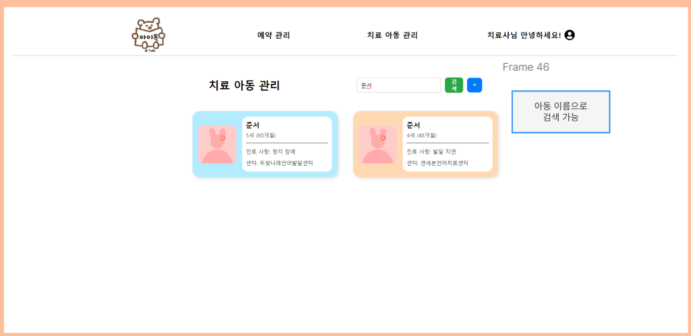</td>
  </tr>
  <tr>
    <td style="text-align: center;" width="25%">아동의 이름으로 검색이 가능합니다.</td>
  </tr>
</table>

<table style="text-align: center;" width="100%">
  <tr>
    <th style="text-align: center;" width="25%">3. 아동 상세 페이지</th>
  </tr>
  <tr>
    <td style="text-align: center;" width="25%">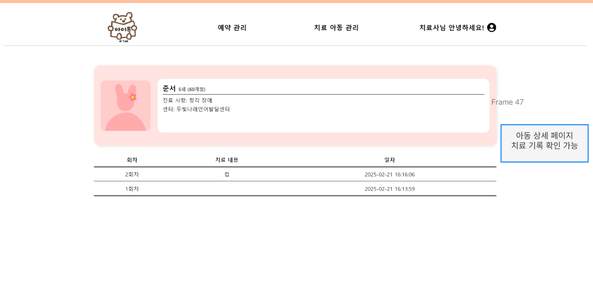</td>
  </tr>
  <tr>
    <td style="text-align: center;" width="25%">치료 아동 상세 정보를 확인할 수 있습니다. 아동의 치료내용도 확인 가능합니다.</td>
  </tr>
</table>

<table style="text-align: center;" width="100%">
  <tr>
    <th style="text-align: center;" width="25%">4. 아동 등록 </th>
  </tr>
  <tr>
    <td style="text-align: center;" width="25%">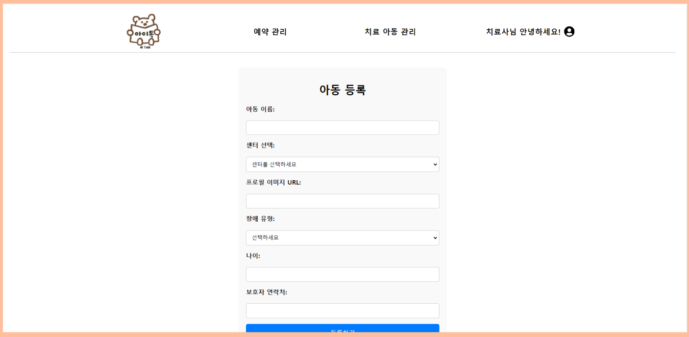</td>
  </tr>
  <tr>
    <td style="text-align: center;" width="25%">치료 아동을 등록합니다. 아동 등록 시 이름, 연령, 목표 치료 영역, 센터, 보호자 번호를 기입합니다.</td>
  </tr>
</table>

## 🛠 빌드 환경
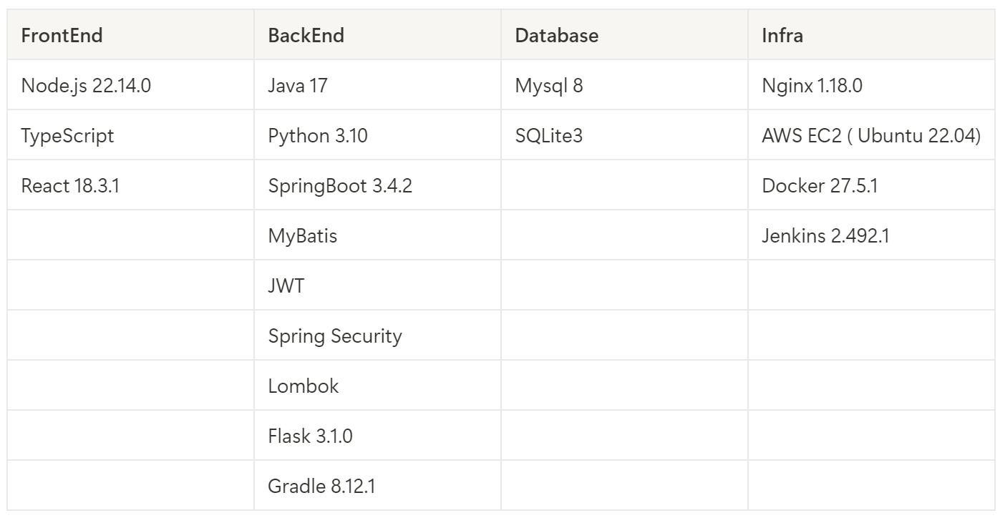

## 🛠 기술 스택 

### 소프트웨어 기술 스택
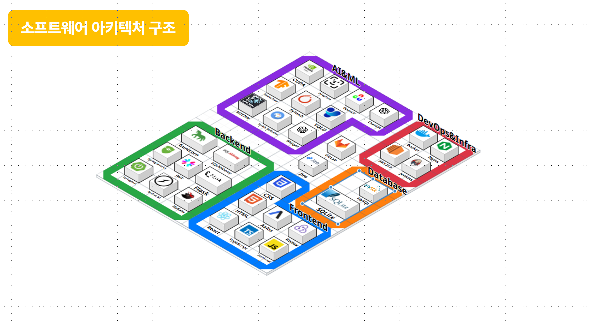

### 하드웨어 기술 스택
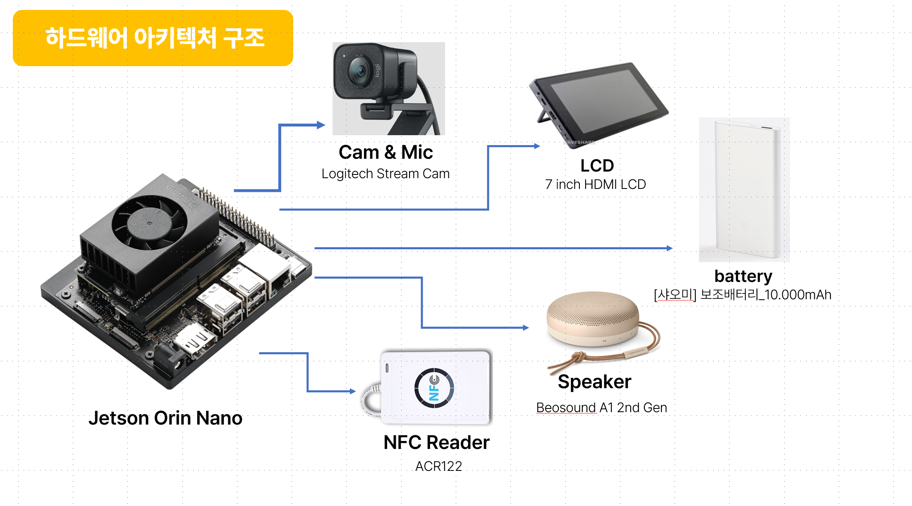

## 🗺️ 기술 아키텍처

### 디바이스 아키텍처
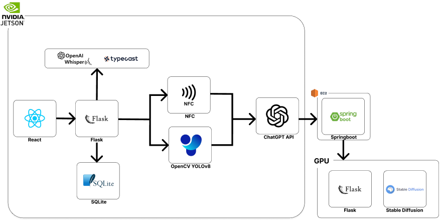

### 웹 아키텍처
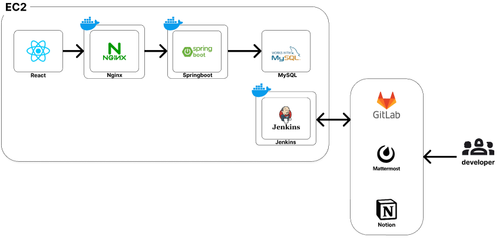

## 📂 프로젝트 폴더 구조

  
<strong>디바이스 Frontend - React</strong>

  <pre>
  📦src
 ┣ 📂assets
 ┃ ┣ 📂AfterLogin
 ┃ ┃ ┣ 📜care_select.svg
 ┃ ┃ ┣ 📜edu_kit.svg
 ┃ ┃ ┗ 📜kid_select.svg
 ┃ ┣ 📂audio
 ┃ ┃ ┣ 📜homepagemusic.mp3
 ┃ ┃ ┗ 📜pagemusic.mp3
 ┃ ┣ 📂Background
 ┃ ┃ ┣ 📜background_1.png
 ┃ ┃ ┣ 📜background_2.png
 ┃ ┃ ┣ 📜background_3.png
 ┃ ┃ ┗ 📜background_4.jpg
 ┃ ┣ 📂card
 ┃ ┃ ┣ 📂animal
 ┃ ┃ ┃ ┣ 📜cat.png
 ┃ ┃ ┃ ┣ 📜dog.png
 ┃ ┃ ┃ ┣ 📜giraffe.png
 ┃ ┃ ┃ ┣ 📜monkey.png
 ┃ ┃ ┃ ┣ 📜panda.png
 ┃ ┃ ┃ ┗ 📜rabbit.png
 ┃ ┃ ┣ 📂fruit
 ┃ ┃ ┃ ┣ 📜apple.png
 ┃ ┃ ┃ ┣ 📜banana.png
 ┃ ┃ ┃ ┣ 📜grape.png
 ┃ ┃ ┃ ┣ 📜orange.png
 ┃ ┃ ┃ ┣ 📜strawberry.png
 ┃ ┃ ┃ ┗ 📜watermelon.png
 ┃ ┃ ┣ 📜ball.png
 ┃ ┃ ┣ 📜bread.png
 ┃ ┃ ┣ 📜car.png
 ┃ ┃ ┣ 📜catch.png
 ┃ ┃ ┣ 📜catchanimal.png
 ┃ ┃ ┣ 📜catchball.png
 ┃ ┃ ┣ 📜catchbread.png
 ┃ ┃ ┣ 📜catchflower.png
 ┃ ┃ ┣ 📜catchfruit.png
 ┃ ┃ ┣ 📜contain.png
 ┃ ┃ ┣ 📜containball.png
 ┃ ┃ ┣ 📜containbread.png
 ┃ ┃ ┣ 📜containflower.png
 ┃ ┃ ┣ 📜containfruit.png
 ┃ ┃ ┣ 📜eat.png
 ┃ ┃ ┣ 📜eatBread.png
 ┃ ┃ ┣ 📜eatfruit.png
 ┃ ┃ ┗ 📜flower.png
 ┃ ┣ 📂ChildDummyImage
 ┃ ┃ ┣ 📜child_1.png
 ┃ ┃ ┣ 📜child_2.png
 ┃ ┃ ┣ 📜child_3.png
 ┃ ┃ ┣ 📜child_4.png
 ┃ ┃ ┗ 📜child_default.png
 ┃ ┣ 📂common
 ┃ ┃ ┣ 📜camera_background.png
 ┃ ┃ ┣ 📜camera_background_2.png
 ┃ ┃ ┣ 📜Home.svg
 ┃ ┃ ┣ 📜img_generate_loading.png
 ┃ ┃ ┣ 📜nfc_tag.png
 ┃ ┃ ┣ 📜sound_off.png
 ┃ ┃ ┗ 📜sound_on.png
 ┃ ┣ 📂Login
 ┃ ┃ ┣ 📜FaceID.png
 ┃ ┃ ┣ 📜FaceID.svg
 ┃ ┃ ┗ 📜FaceID_small.svg
 ┃ ┣ 📂logo
 ┃ ┃ ┣ 📜aitalk_logo.png
 ┃ ┃ ┗ 📜loading_logo.png
 ┃ ┣ 📂mascot
 ┃ ┃ ┣ 📜Listen.png
 ┃ ┃ ┣ 📜Smile.png
 ┃ ┃ ┗ 📜Talk.png
 ┃ ┗ 📂menu
 ┃ ┃ ┣ 📜camera.png
 ┃ ┃ ┣ 📜nfc_card.png
 ┃ ┃ ┗ 📜symbol.png
 ┣ 📂components
 ┃ ┣ 📂Buttons
 ┃ ┃ ┣ 📜AiTalkButton.tsx
 ┃ ┃ ┣ 📜CameraButton.tsx
 ┃ ┃ ┣ 📜CardTagButton.tsx
 ┃ ┃ ┣ 📜CardTagButtonForFaceResist.tsx
 ┃ ┃ ┣ 📜CardTagButtonForLogin.tsx
 ┃ ┃ ┗ 📜LogoutButton.tsx
 ┃ ┣ 📂Camera
 ┃ ┃ ┣ 📜CameraBox.tsx
 ┃ ┃ ┣ 📜UseObjectDetector.tsx
 ┃ ┃ ┗ 📜VideoConstraints.tsx
 ┃ ┣ 📂Cards
 ┃ ┃ ┗ 📜ChildCard.tsx
 ┃ ┣ 📂Common
 ┃ ┃ ┣ 📜AiInfoContainer.css
 ┃ ┃ ┣ 📜AiInfoContainer.tsx
 ┃ ┃ ┣ 📜AudioContext.tsx
 ┃ ┃ ┣ 📜BackButton.css
 ┃ ┃ ┣ 📜BackButton.tsx
 ┃ ┃ ┣ 📜BackgroundContainer.css
 ┃ ┃ ┣ 📜BackgroundContainer.tsx
 ┃ ┃ ┣ 📜BackgroundKidContainer.css
 ┃ ┃ ┣ 📜BackgroundKidContainer.tsx
 ┃ ┃ ┣ 📜BackPlaySelectButton.css
 ┃ ┃ ┣ 📜BackPlaySelectButton.tsx
 ┃ ┃ ┣ 📜CardInfoContainer.css
 ┃ ┃ ┣ 📜CardInfoContainer.tsx
 ┃ ┃ ┣ 📜CateCardInfoContainer.css
 ┃ ┃ ┣ 📜CateCardInfoContainer.tsx
 ┃ ┃ ┣ 📜CategoryCardInfoContainer.css
 ┃ ┃ ┣ 📜CategoryCardInfoContainer.tsx
 ┃ ┃ ┣ 📜GenerateLoading.tsx
 ┃ ┃ ┣ 📜HomeButton.css
 ┃ ┃ ┣ 📜HomeButton.tsx
 ┃ ┃ ┣ 📜LoadingCircle.css
 ┃ ┃ ┣ 📜LoadingCircle.tsx
 ┃ ┃ ┣ 📜NavbarContainer.css
 ┃ ┃ ┣ 📜NavbarContainer.tsx
 ┃ ┃ ┣ 📜ThreeSentenceButton.css
 ┃ ┃ ┣ 📜ThreeSentenceButton.tsx
 ┃ ┃ ┣ 📜WordButton.css
 ┃ ┃ ┗ 📜WordButton.tsx
 ┃ ┣ 📂Dialogs
 ┃ ┃ ┣ 📜CameraDialog.tsx
 ┃ ┃ ┗ 📜ResistCameraDialog.tsx
 ┃ ┣ 📂FaceID
 ┃ ┃ ┗ 📜FaceIdAnimationLoading.tsx
 ┃ ┣ 📂Images
 ┃ ┃ ┣ 📜ImgGenerateImage.css
 ┃ ┃ ┣ 📜ImgGenerateImage.tsx
 ┃ ┃ ┣ 📜NfcImage.css
 ┃ ┃ ┗ 📜NfcImage.tsx
 ┃ ┣ 📂logo
 ┃ ┃ ┣ 📜HomeLogo.css
 ┃ ┃ ┗ 📜HomeLogo.tsx
 ┃ ┣ 📂Texts
 ┃ ┃ ┣ 📜CurrentUserText.tsx
 ┃ ┃ ┣ 📜DetailPlaySelectText.css
 ┃ ┃ ┣ 📜DetailPlaySelectText.tsx
 ┃ ┃ ┣ 📜ImgGenerateText.css
 ┃ ┃ ┣ 📜ImgGenerateText.tsx
 ┃ ┃ ┣ 📜NfcTagText.css
 ┃ ┃ ┣ 📜NfcTagText.tsx
 ┃ ┃ ┣ 📜PlaySelectText.css
 ┃ ┃ ┣ 📜PlaySelectText.tsx
 ┃ ┃ ┗ 📜TextFontFromGoogle.css
 ┃ ┗ 📂ui
 ┃ ┃ ┣ 📜close-button.tsx
 ┃ ┃ ┗ 📜dialog.tsx
 ┣ 📂feature
 ┃ ┣ 📂child
 ┃ ┃ ┗ 📜childSlice.tsx
 ┃ ┣ 📂treatment
 ┃ ┃ ┗ 📜treatmentSlice.tsx
 ┃ ┣ 📂user
 ┃ ┃ ┗ 📜userSlice.tsx
 ┃ ┗ 📜store.tsx
 ┣ 📂hooks
 ┃ ┣ 📜UseCardTagForFaceResist.tsx
 ┃ ┣ 📜UseCardTagLogin.tsx
 ┃ ┣ 📜UseFaceRegistration.tsx
 ┃ ┣ 📜UseFaceVerification.tsx
 ┃ ┣ 📜UseFetch.tsx
 ┃ ┣ 📜UsePlayStart.tsx
 ┃ ┣ 📜UseTherapistLogin.tsx
 ┃ ┗ 📜UseThreeSentence.ts
 ┣ 📂pages
 ┃ ┣ 📜AiTalkPage.css
 ┃ ┣ 📜AiTalkPage.tsx
 ┃ ┣ 📜CameraImageGeneratePage.css
 ┃ ┣ 📜CameraImageGeneratePage.tsx
 ┃ ┣ 📜CameraPlaySelectPage.css
 ┃ ┣ 📜CameraPlaySelectPage.tsx
 ┃ ┣ 📜CameraScanPage.css
 ┃ ┣ 📜CameraScanPage.tsx
 ┃ ┣ 📜CardPlaySelectPage.css
 ┃ ┣ 📜CardPlaySelectPage.tsx
 ┃ ┣ 📜CardPlaySelectThreeSentencePage.css
 ┃ ┣ 📜CardPlaySelectThreeSentencePage.tsx
 ┃ ┣ 📜CardPlaySelectWordPage.css
 ┃ ┣ 📜CardPlaySelectWordPage.tsx
 ┃ ┣ 📜CardPlaySelectWordVerbPage.css
 ┃ ┣ 📜CardPlaySelectWordVerbPage.tsx
 ┃ ┣ 📜CardPlaySelectWordVerbSentencePage.css
 ┃ ┣ 📜CardPlaySelectWordVerbSentencePage.tsx
 ┃ ┣ 📜CategoryCardPlaySelectPage.css
 ┃ ┣ 📜CategoryCardPlaySelectPage.tsx
 ┃ ┣ 📜HomeAfterLoginPage.tsx
 ┃ ┣ 📜HomePage.css
 ┃ ┣ 📜HomePage.tsx
 ┃ ┣ 📜KidFaceLoginPage.tsx
 ┃ ┣ 📜KidSelectPage.tsx
 ┃ ┣ 📜NfcTagForFaceRegistPage.tsx
 ┃ ┣ 📜NfcTagForLoginPage.tsx
 ┃ ┣ 📜NfcTagPage.css
 ┃ ┣ 📜NfcTagPage.tsx
 ┃ ┣ 📜PlaySelectPage.css
 ┃ ┣ 📜PlaySelectPage.tsx
 ┃ ┣ 📜TherapistFaceLoginPage.tsx
 ┃ ┣ 📜TherapistFaceRegisterCompletePage.tsx
 ┃ ┣ 📜TherapistFaceRegisterPage.tsx
 ┃ ┗ 📜TherapistLoginPage.tsx
 ┣ 📂utils
 ┃ ┣ 📜ChunkArray.tsx
 ┃ ┗ 📜UseScaleFactor.tsx
 ┣ 📜App.css
 ┣ 📜App.tsx
 ┣ 📜coco-ssd.d.ts
 ┣ 📜main.tsx
 ┗ 📜vite-env.d.ts
  </pre>

  
<strong>디바이스 Backend - Flask</strong>

  <pre>
  📦flask-backend
 ┣ 📂app
 ┃ ┣ 📂models
 ┃ ┃ ┣ 📜card_model.py
 ┃ ┃ ┣ 📜child_model.py
 ┃ ┃ ┣ 📜schedule_model.py
 ┃ ┃ ┣ 📜therapist.py
 ┃ ┃ ┗ 📜__init__.py
 ┃ ┣ 📂routes
 ┃ ┃ ┣ 📜camera_sentence_route.py
 ┃ ┃ ┣ 📜card_routes.py
 ┃ ┃ ┣ 📜child_face.py
 ┃ ┃ ┣ 📜child_route.py
 ┃ ┃ ┣ 📜detect.py
 ┃ ┃ ┣ 📜image_route.py
 ┃ ┃ ┣ 📜play_start_route.py
 ┃ ┃ ┣ 📜sentence_routes.py
 ┃ ┃ ┣ 📜session_routes.py
 ┃ ┃ ┣ 📜speech_route.py
 ┃ ┃ ┣ 📜therapist_login.py
 ┃ ┃ ┣ 📜user_face.py
 ┃ ┃ ┗ 📜__init__.py
 ┃ ┣ 📂services
 ┃ ┃ ┣ 📜camera.py
 ┃ ┃ ┣ 📜camera_sentence_service.py
 ┃ ┃ ┣ 📜card_service.py
 ┃ ┃ ┣ 📜child_choice_service.py
 ┃ ┃ ┣ 📜child_face_recognition.py
 ┃ ┃ ┣ 📜detect_objects.py
 ┃ ┃ ┣ 📜login_service.py
 ┃ ┃ ┣ 📜play_start_service.py
 ┃ ┃ ┣ 📜sentence_service.py
 ┃ ┃ ┣ 📜speech_service.py
 ┃ ┃ ┣ 📜sync_service.py
 ┃ ┃ ┣ 📜therapist_login_service.py
 ┃ ┃ ┣ 📜user_face_recognition.py
 ┃ ┃ ┣ 📜yolov8n.pt
 ┃ ┃ ┗ 📜__init__.py
 ┃ ┣ 📂utils
 ┃ ┃ ┣ 📜hash_utils.py
 ┃ ┃ ┣ 📜nfc_reader.py
 ┃ ┃ ┗ 📜__init__.py
 ┃ ┣ 📜child_face_db.csv
 ┃ ┣ 📜extensions.py
 ┃ ┣ 📜yolov8n.pt
 ┃ ┗ 📜__init__.py
 ┣ 📂utils
 ┃ ┣ 📜sqlite_handler.py
 ┃ ┗ 📜__init__.py
 ┣ 📜.gitignore
 ┣ 📜app.py
 ┣ 📜child_face_db.csv
 ┣ 📜config.py
 ┣ 📜data.sql
 ┣ 📜dummy.sql
 ┣ 📜face_db.csv
 ┣ 📜package-lock.json
 ┗ 📜yolov8n.pt
  </pre>

  
<strong>웹 Frontend - React</strong>

  <pre>
  📦src
 ┣ 📂assets
 ┃ ┣ 📂images
 ┃ ┃ ┗ 📂main
 ┃ ┃ ┃ ┣ 📜care_child_button.png
 ┃ ┃ ┃ ┣ 📜logo.png
 ┃ ┃ ┃ ┣ 📜profile_img.png
 ┃ ┃ ┃ ┣ 📜schedule_button.png
 ┃ ┃ ┃ ┗ 📜speech_therapist.png
 ┃ ┗ 📂User
 ┃ ┃ ┣ 📜AiTalkLogo.svg
 ┃ ┃ ┗ 📜UserBackgroud.svg
 ┣ 📂components
 ┃ ┣ 📂common
 ┃ ┃ ┗ 📜Modal.tsx
 ┃ ┣ 📂main
 ┃ ┃ ┣ 📂child
 ┃ ┃ ┃ ┣ 📜CardContainer.css
 ┃ ┃ ┃ ┣ 📜CardContainer.tsx
 ┃ ┃ ┃ ┣ 📜ChildScheduleList.css
 ┃ ┃ ┃ ┣ 📜ChildScheduleList.tsx
 ┃ ┃ ┃ ┣ 📜DetailCardContainer.css
 ┃ ┃ ┃ ┗ 📜DetailCardContainer.tsx
 ┃ ┃ ┣ 📂common
 ┃ ┃ ┃ ┣ 📜Header.css
 ┃ ┃ ┃ ┗ 📜Header.tsx
 ┃ ┃ ┗ 📂schedule
 ┃ ┃ ┃ ┣ 📜DayScheduleComponent.css
 ┃ ┃ ┃ ┣ 📜DayScheduleComponent.tsx
 ┃ ┃ ┃ ┣ 📜DetailScheduleComponent.css
 ┃ ┃ ┃ ┣ 📜DetailScheduleComponent.tsx
 ┃ ┃ ┃ ┣ 📜modal.css
 ┃ ┃ ┃ ┣ 📜ScheduleDialog.tsx
 ┃ ┃ ┃ ┣ 📜ScheduleRegisterComponent.css
 ┃ ┃ ┃ ┗ 📜ScheduleRegisterComponent.tsx
 ┃ ┗ 📂user
 ┃ ┃ ┗ 📂common
 ┃ ┃ ┃ ┣ 📜ConfirmButton.tsx
 ┃ ┃ ┃ ┣ 📜EmailAuthComponent.css
 ┃ ┃ ┃ ┣ 📜EmailAuthComponent.tsx
 ┃ ┃ ┃ ┣ 📜InputComponent.tsx
 ┃ ┃ ┃ ┣ 📜UserMainContainer.css
 ┃ ┃ ┃ ┗ 📜UserMainContainer.tsx
 ┣ 📂hooks
 ┃ ┗ 📂user
 ┃ ┃ ┣ 📜useEmailAuth.ts
 ┃ ┃ ┣ 📜useEmailAuthConfirm.ts
 ┃ ┃ ┣ 📜useFindId.ts
 ┃ ┃ ┣ 📜useFindPw.ts
 ┃ ┃ ┣ 📜useLogin.ts
 ┃ ┃ ┣ 📜useResetPw.ts
 ┃ ┃ ┗ 📜useSignUp.ts
 ┣ 📂pages
 ┃ ┣ 📂main
 ┃ ┃ ┣ 📂child
 ┃ ┃ ┃ ┣ 📜ChildDetailPage.css
 ┃ ┃ ┃ ┣ 📜ChildDetailPage.tsx
 ┃ ┃ ┃ ┣ 📜ChildListPage.css
 ┃ ┃ ┃ ┣ 📜ChildListPage.tsx
 ┃ ┃ ┃ ┣ 📜ChildRegisterPage.css
 ┃ ┃ ┃ ┗ 📜ChildRegisterPage.tsx
 ┃ ┃ ┣ 📜HomePage.css
 ┃ ┃ ┣ 📜HomePage.tsx
 ┃ ┃ ┣ 📜Main.tsx
 ┃ ┃ ┣ 📜MyPage.css
 ┃ ┃ ┣ 📜MyPage.tsx
 ┃ ┃ ┣ 📜SchedulePage.css
 ┃ ┃ ┗ 📜SchedulePage.tsx
 ┃ ┗ 📂user
 ┃ ┃ ┣ 📜User.tsx
 ┃ ┃ ┣ 📜UserFindIdPage.tsx
 ┃ ┃ ┣ 📜UserFindPwPage.tsx
 ┃ ┃ ┣ 📜UserLoginPage.css
 ┃ ┃ ┣ 📜UserLoginPage.tsx
 ┃ ┃ ┣ 📜UserPwReset.tsx
 ┃ ┃ ┣ 📜UserSignUpPage.css
 ┃ ┃ ┗ 📜UserSignUpPage.tsx
 ┣ 📂routes
 ┃ ┣ 📜AppRoutes.tsx
 ┃ ┣ 📜MainRoutes.tsx
 ┃ ┗ 📜UserRoutes.tsx
 ┣ 📂utils
 ┃ ┣ 📜axiosInstance.ts
 ┃ ┣ 📜careChildrenDummyData.ts
 ┃ ┗ 📜treatmentDummyData.ts
 ┣ 📜App.css
 ┣ 📜App.tsx
 ┣ 📜main.tsx
 ┗ 📜vite-env.d.ts
  </pre>

  
<strong>웹 Backend - Spring Boot</strong>

  <pre>
  📦src
 ┣ 📂main
 ┃ ┣ 📂java
 ┃ ┃ ┗ 📂com
 ┃ ┃ ┃ ┗ 📂ssafy
 ┃ ┃ ┃ ┃ ┗ 📂aitalk
 ┃ ┃ ┃ ┃ ┃ ┣ 📂child
 ┃ ┃ ┃ ┃ ┃ ┃ ┣ 📂controller
 ┃ ┃ ┃ ┃ ┃ ┃ ┃ ┗ 📜ChildController.java
 ┃ ┃ ┃ ┃ ┃ ┃ ┣ 📂dto
 ┃ ┃ ┃ ┃ ┃ ┃ ┃ ┣ 📜CenterListResponse.java
 ┃ ┃ ┃ ┃ ┃ ┃ ┃ ┣ 📜ChildDetailResponse.java
 ┃ ┃ ┃ ┃ ┃ ┃ ┃ ┣ 📜ChildMessageResponse.java
 ┃ ┃ ┃ ┃ ┃ ┃ ┃ ┣ 📜ChildRegisterRequest.java
 ┃ ┃ ┃ ┃ ┃ ┃ ┃ ┣ 📜ChildrenListResponse.java
 ┃ ┃ ┃ ┃ ┃ ┃ ┃ ┣ 📜ChildScheduleResponse.java
 ┃ ┃ ┃ ┃ ┃ ┃ ┃ ┗ 📜ChildUpdateRequest.java
 ┃ ┃ ┃ ┃ ┃ ┃ ┣ 📂entity
 ┃ ┃ ┃ ┃ ┃ ┃ ┃ ┣ 📜Center.java
 ┃ ┃ ┃ ┃ ┃ ┃ ┃ ┗ 📜Child.java
 ┃ ┃ ┃ ┃ ┃ ┃ ┣ 📂mapper
 ┃ ┃ ┃ ┃ ┃ ┃ ┃ ┗ 📜ChildMapper.java
 ┃ ┃ ┃ ┃ ┃ ┃ ┗ 📂service
 ┃ ┃ ┃ ┃ ┃ ┃ ┃ ┣ 📜ChildService.java
 ┃ ┃ ┃ ┃ ┃ ┃ ┃ ┗ 📜ChildServiceImpl.java
 ┃ ┃ ┃ ┃ ┃ ┣ 📂schedule
 ┃ ┃ ┃ ┃ ┃ ┃ ┣ 📂controller
 ┃ ┃ ┃ ┃ ┃ ┃ ┃ ┗ 📜ScheduleController.java
 ┃ ┃ ┃ ┃ ┃ ┃ ┣ 📂dto
 ┃ ┃ ┃ ┃ ┃ ┃ ┃ ┣ 📜DailyScheduleResponse.java
 ┃ ┃ ┃ ┃ ┃ ┃ ┃ ┣ 📜MonthlyScheduleResponse.java
 ┃ ┃ ┃ ┃ ┃ ┃ ┃ ┣ 📜ScheduleDetailResponse.java
 ┃ ┃ ┃ ┃ ┃ ┃ ┃ ┣ 📜ScheduleMessageResponse.java
 ┃ ┃ ┃ ┃ ┃ ┃ ┃ ┣ 📜ScheduleRegistRequest.java
 ┃ ┃ ┃ ┃ ┃ ┃ ┃ ┗ 📜ScheduleUpdateRequest.java
 ┃ ┃ ┃ ┃ ┃ ┃ ┣ 📂entity
 ┃ ┃ ┃ ┃ ┃ ┃ ┃ ┗ 📜Schedule.java
 ┃ ┃ ┃ ┃ ┃ ┃ ┣ 📂mapper
 ┃ ┃ ┃ ┃ ┃ ┃ ┃ ┗ 📜ScheduleMapper.java
 ┃ ┃ ┃ ┃ ┃ ┃ ┣ 📂service
 ┃ ┃ ┃ ┃ ┃ ┃ ┃ ┣ 📜ScheduleService.java
 ┃ ┃ ┃ ┃ ┃ ┃ ┃ ┗ 📜ScheduleServiceImpl.java
 ┃ ┃ ┃ ┃ ┃ ┃ ┗ 📂typehandler
 ┃ ┃ ┃ ┃ ┃ ┃ ┃ ┗ 📜JsonTypeHandler.java
 ┃ ┃ ┃ ┃ ┃ ┣ 📂test
 ┃ ┃ ┃ ┃ ┃ ┃ ┗ 📜ApiController.java
 ┃ ┃ ┃ ┃ ┃ ┣ 📂user
 ┃ ┃ ┃ ┃ ┃ ┃ ┣ 📂config
 ┃ ┃ ┃ ┃ ┃ ┃ ┃ ┣ 📜MyBatisConfig.java
 ┃ ┃ ┃ ┃ ┃ ┃ ┃ ┗ 📜SecurityConfig.java
 ┃ ┃ ┃ ┃ ┃ ┃ ┣ 📂controller
 ┃ ┃ ┃ ┃ ┃ ┃ ┃ ┗ 📜UserController.java
 ┃ ┃ ┃ ┃ ┃ ┃ ┣ 📂dto
 ┃ ┃ ┃ ┃ ┃ ┃ ┃ ┣ 📜ChangePasswordRequest.java
 ┃ ┃ ┃ ┃ ┃ ┃ ┃ ┣ 📜EmailVerificationConfirmRequest.java
 ┃ ┃ ┃ ┃ ┃ ┃ ┃ ┣ 📜EmailVerificationRequest.java
 ┃ ┃ ┃ ┃ ┃ ┃ ┃ ┣ 📜LoginRequest.java
 ┃ ┃ ┃ ┃ ┃ ┃ ┃ ┣ 📜LoginResponse.java
 ┃ ┃ ┃ ┃ ┃ ┃ ┃ ┣ 📜PasswordResponse.java
 ┃ ┃ ┃ ┃ ┃ ┃ ┃ ┣ 📜RegisterRequest.java
 ┃ ┃ ┃ ┃ ┃ ┃ ┃ ┣ 📜RegisterResponse.java
 ┃ ┃ ┃ ┃ ┃ ┃ ┃ ┣ 📜SendVerificationCodeRequest.java
 ┃ ┃ ┃ ┃ ┃ ┃ ┃ ┣ 📜UpdateInfoRequest.java
 ┃ ┃ ┃ ┃ ┃ ┃ ┃ ┣ 📜UpdateInfoResponse.java
 ┃ ┃ ┃ ┃ ┃ ┃ ┃ ┣ 📜UserResponse.java
 ┃ ┃ ┃ ┃ ┃ ┃ ┃ ┣ 📜UserUpdateResponse.java
 ┃ ┃ ┃ ┃ ┃ ┃ ┃ ┗ 📜VerifyCodeRequest.java
 ┃ ┃ ┃ ┃ ┃ ┃ ┣ 📂entity
 ┃ ┃ ┃ ┃ ┃ ┃ ┃ ┗ 📜User.java
 ┃ ┃ ┃ ┃ ┃ ┃ ┣ 📂mapper
 ┃ ┃ ┃ ┃ ┃ ┃ ┃ ┗ 📜UserMapper.java
 ┃ ┃ ┃ ┃ ┃ ┃ ┣ 📂security
 ┃ ┃ ┃ ┃ ┃ ┃ ┃ ┗ 📜JwtAuthorizationFilter.java
 ┃ ┃ ┃ ┃ ┃ ┃ ┣ 📂service
 ┃ ┃ ┃ ┃ ┃ ┃ ┃ ┣ 📜EmailService.java
 ┃ ┃ ┃ ┃ ┃ ┃ ┃ ┣ 📜EmailServiceImpl.java
 ┃ ┃ ┃ ┃ ┃ ┃ ┃ ┣ 📜EmailTest.java
 ┃ ┃ ┃ ┃ ┃ ┃ ┃ ┣ 📜UserService.java
 ┃ ┃ ┃ ┃ ┃ ┃ ┃ ┗ 📜UserServiceImpl.java
 ┃ ┃ ┃ ┃ ┃ ┃ ┗ 📂util
 ┃ ┃ ┃ ┃ ┃ ┃ ┃ ┣ 📜EmailVerificationStorage.java
 ┃ ┃ ┃ ┃ ┃ ┃ ┃ ┗ 📜JwtUtil.java
 ┃ ┃ ┃ ┃ ┃ ┗ 📜AiTalkApplication.java
 ┃ ┗ 📂resources
 ┃ ┃ ┣ 📂mappers
 ┃ ┃ ┃ ┣ 📜ChildMapper.xml
 ┃ ┃ ┃ ┣ 📜ScheduleMapper.xml
 ┃ ┃ ┃ ┗ 📜UserMapper.xml
 ┃ ┃ ┣ 📜application.yml
 ┃ ┃ ┣ 📜data.sql
 ┃ ┃ ┗ 📜schema.sql
 ┣ 📂test
 ┃ ┗ 📂java
 ┃ ┃ ┗ 📂com
 ┃ ┃ ┃ ┗ 📂ssafy
 ┃ ┃ ┃ ┃ ┗ 📂aitalk
 ┃ ┃ ┃ ┃ ┃ ┗ 📜AiTalkApplicationTests.java
 ┗ 📜webbackend.txt
  </pre>

## 📜 산출물

  
<strong>요구사항 명세서</strong>

  <h3>🔹 회원</h3>
  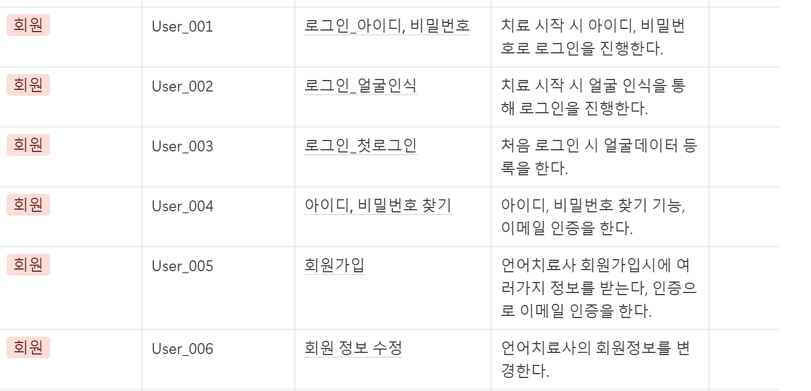
  <h3>🔹 관리</h3>
  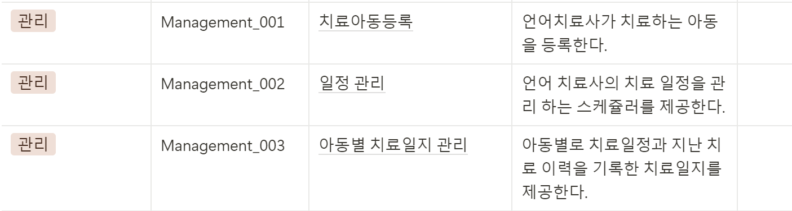
  <h3>🔹 치료 아동</h3>
  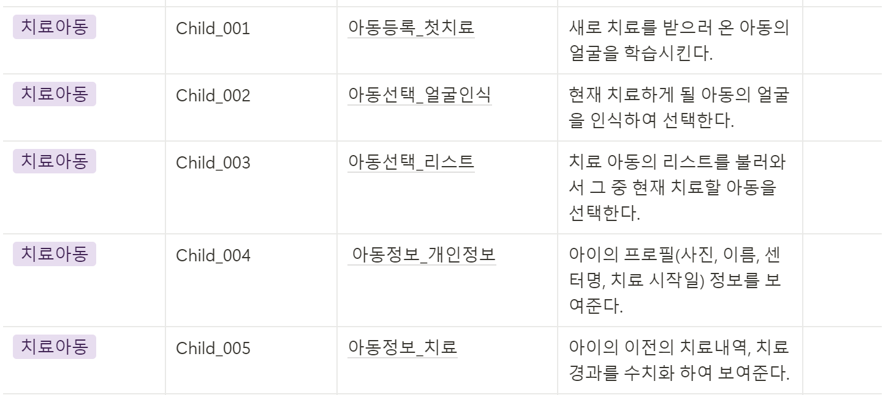
  <h3>🔹 치료 관리</h3>
  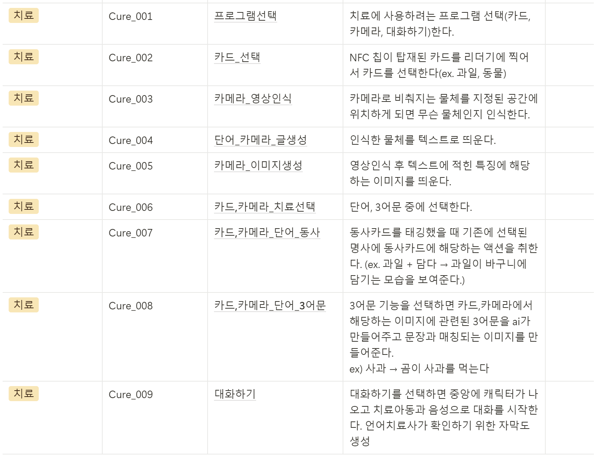

  
<strong>erd 테이블</strong>

  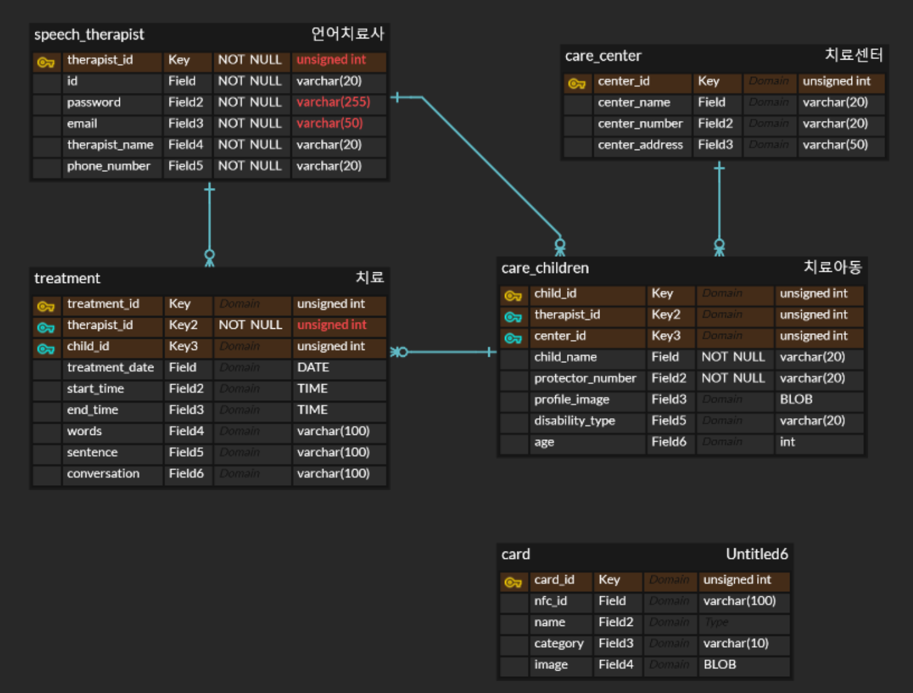

  
<strong>피그마</strong>

  <h3>🔹 회원 관리</h3>
  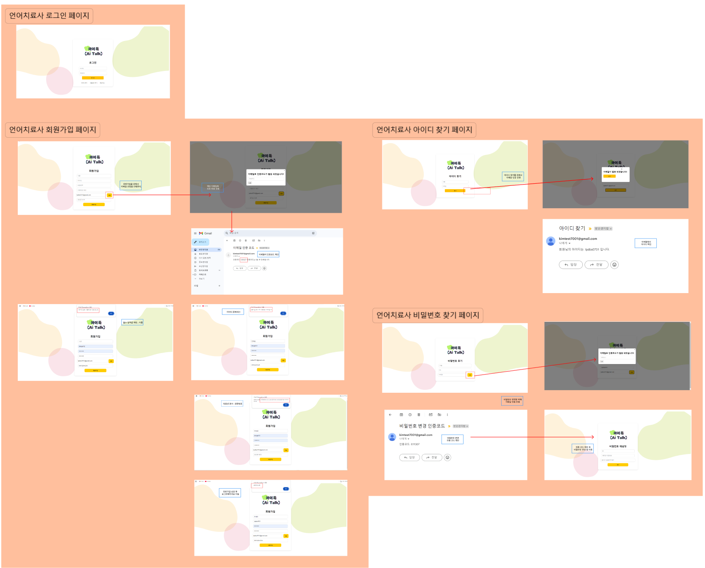
  <h3>🔹 스케줄 관리</h3>
  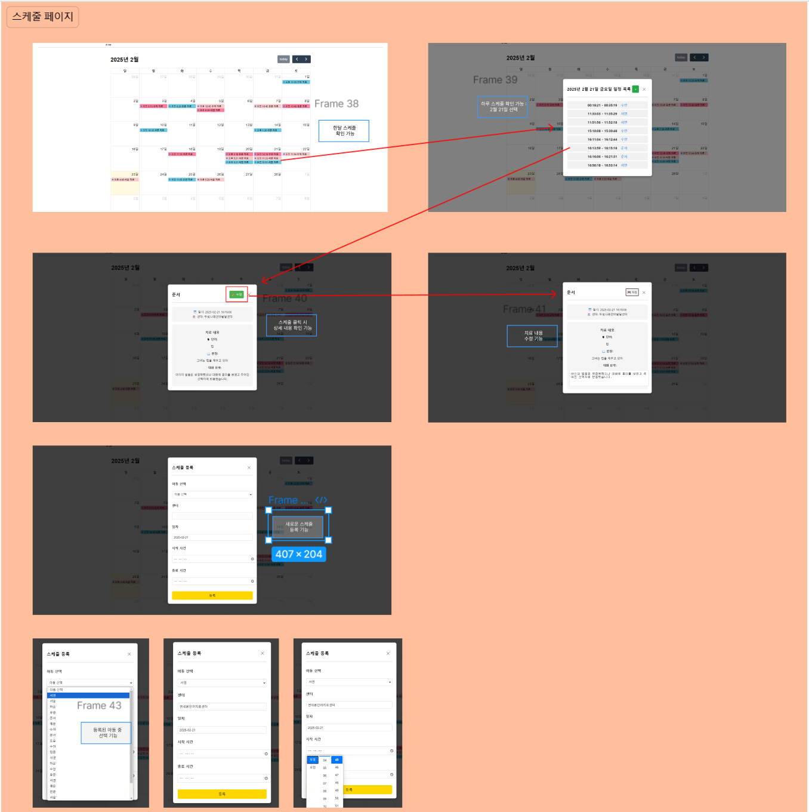
  <h3>🔹 치료 아동 관리</h3>
  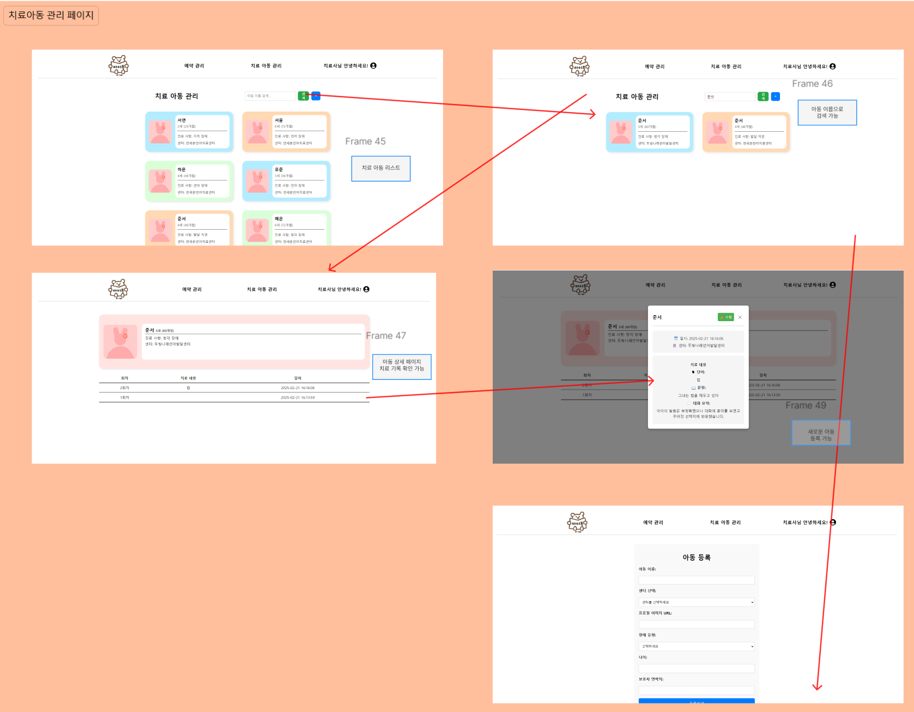
  <h3>🔹 홈화면</h3>
  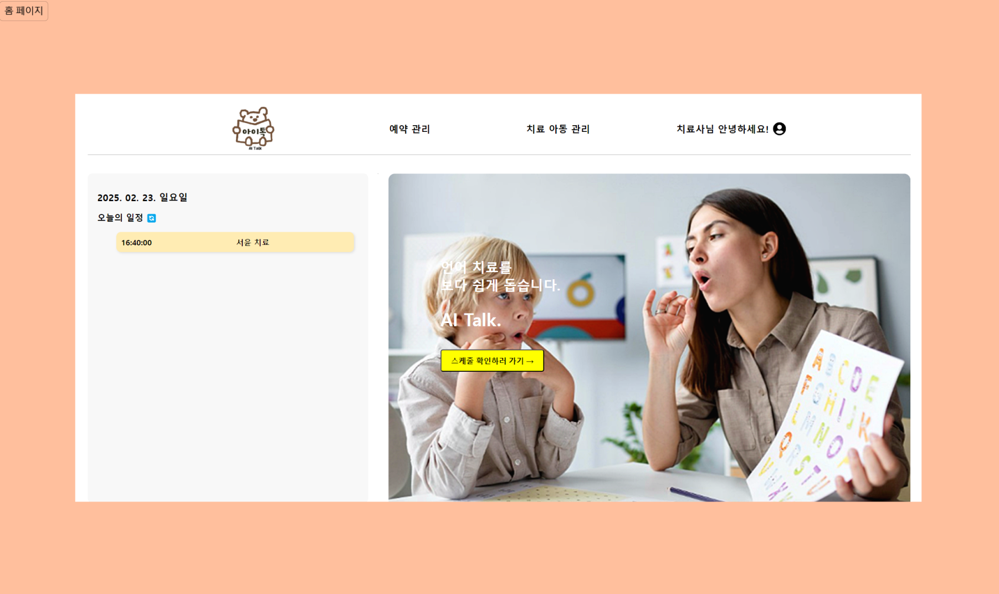

  
<strong>api 명세서</strong>

  <h3>🔹 회원 api</h3>
  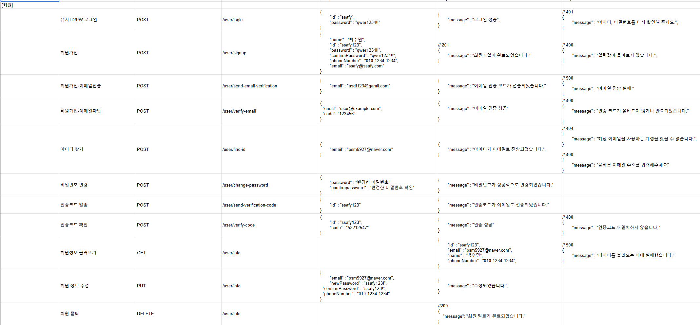
  <h3>🔹 치료 아동 및 스케줄 api</h3>
  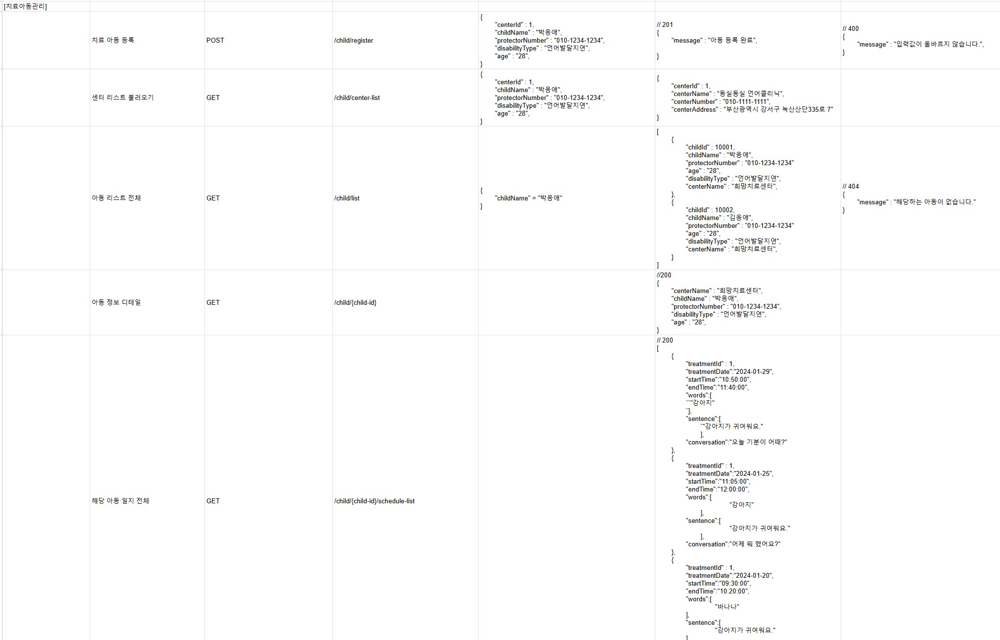
  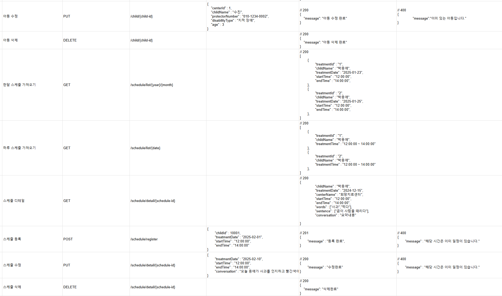
  <h3>🔹 치료 교구 api</h3>
  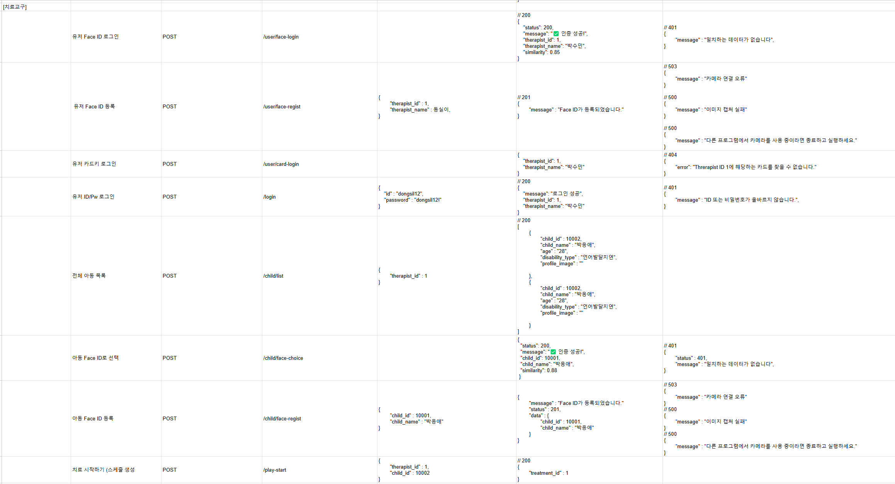
  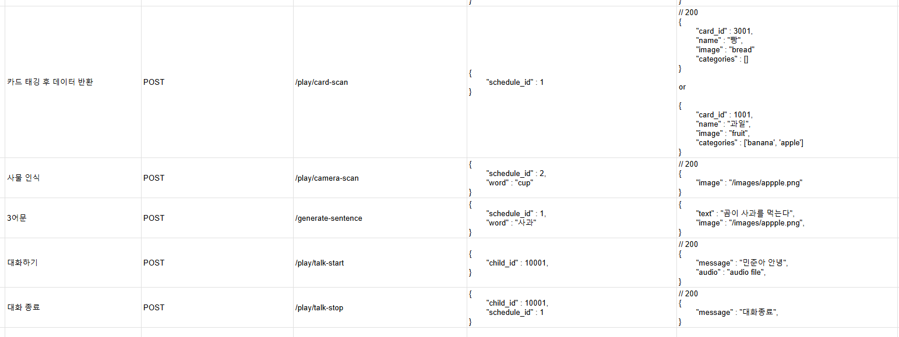

